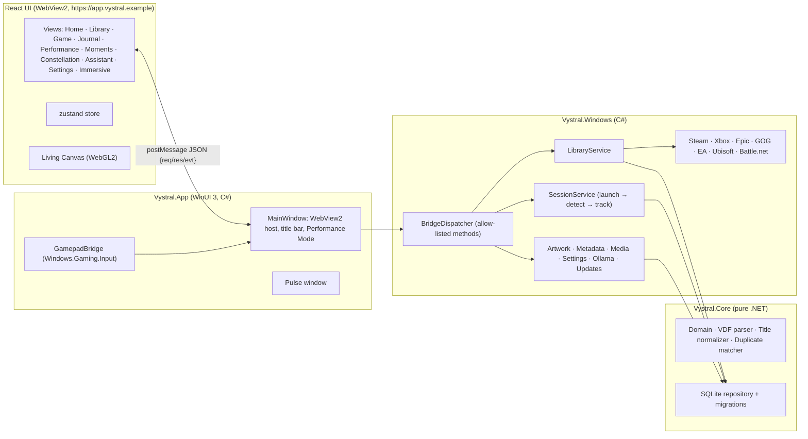

# VYSTRAL architecture

VYSTRAL is a **modular monolith**: one Windows process owns the window, the data and every integration; the interface is a React app hosted in WebView2 inside that process. There is no local web server and no Windows service. The only other process is the optional, off-by-default **background tracker** (the same `Vystral.exe` started with `--background-tracker`, see below), which records games while the app is closed.

## Projects

| Project | Target | Responsibility |
|---|---|---|
| `src/Vystral.Core` | `net10.0` | Domain model, Valve KeyValues (VDF) parser, title normalization, conservative duplicate matching, SQLite schema/migrations/repository, bridge DTOs. No Windows dependencies, so it is fully unit-testable. |
| `src/Vystral.Windows` | `net10.0-windows10.0.22621` | Store adapters, launch validation and execution, process detection, read-only performance sampling, artwork cache, metadata enrichment, Moments media, Ollama client, Velopack updater, settings, and the bridge dispatcher with every handler (`AppBackend*`). |
| `src/Vystral.App` | WinUI 3 (Windows App SDK 2.5, self-contained, unpackaged) | Entry point, single-instance handling, the window, WebView2 hosting and lockdown, native file pickers, controller input, Performance Mode, the Pulse window. |
| `ui/` | React 19 + TypeScript (strict) + Vite | The entire interface. Talks only to the bridge. |
| `tests/Vystral.Tests` | xunit v3 | Core, adapters (with fixture files and a fake registry), services and bridge. |

## Key decisions

**WinUI 3 + WebView2 rather than Electron or pure XAML.** WinUI gives a genuinely native window (Mica-capable title bar, AppWindow presenters for full-screen, Windows.Gaming.Input, packaged-app activation) and a single self-contained process tree. WebView2 gives the GPU-accelerated motion, shaders and typography the design calls for, and lets the UI be developed and tested in a normal browser. WebView2 is part of Windows 11, so there is no bundled browser.

**No local HTTP server.** UI files are served by `SetVirtualHostNameToFolderMapping` from the install folder (`https://app.vystral.example/`). Artwork is served from a second mapping that points only at the private art cache (`https://art.vystral.example/`). Media from user-approved folders goes through a filtered `WebResourceRequested` handler (`https://media.vystral.example/`) that resolves paths only inside approved folders and only for image/video types. Reserved `.example` hostnames never collide with real sites.

**One message bridge, strictly typed.** The UI sends `{kind:"req", id, method, params}` with `postMessage`; the host replies `{kind:"res", id, ok, result|error}` and pushes `{kind:"evt", name, payload}`. Only registered methods run. Parameters bind to C# records with unknown members rejected, and every handler validates IDs (`[0-9a-f]{32}`), string lengths and control characters. File paths **never** come from the UI: they come from native pickers or the database. Host objects and dev tools are disabled in release builds, and all navigation outside the app origin is cancelled.

**Adapters are read-only and honest.** Each `IPlatformAdapter` declares `AdapterCapabilities` and plain-language `Limitations`, which the Settings page shows verbatim. Adapters read documented local manifests and registry keys. They never read credentials and never write. Each runs isolated with a 30 s timeout; a failed scan changes nothing, so a broken integration can't erase history.

**Launch is validated, observed and never repeated.** `LaunchValidator` allow-lists URI schemes per platform (`steam:` only for Steam, and so on), validates AUMIDs, and only starts `.exe` files inside the game's own install folder. URIs go through ShellExecute, executables through CreateProcess with an argument list (no shell), and packaged games through `IApplicationActivationManager`. `SessionService` reports *running* only after it observes a process under the install folder (using `PROCESS_QUERY_LIMITED_INFORMATION` image paths, the same data Task Manager shows). It follows launcher→game hand-offs and never relaunches anything.

**Games started outside VYSTRAL (opt-in, `tracking.background`).** One detector (`Tracking/GameDetector`, a pure state machine) and one recorder serve both processes, so a game is recognised and recorded the same way whether VYSTRAL launched it, noticed it while open (`sessions.source = 'detected'`) or noticed it while closed (`'background'`):

- *Matching* is exactly a launch's rule (`ProcessScanner.FindUnder`: an executable inside the installation's folder, or a hinted file name for games without one; store-client folders excluded), indexed by folder (`GameMatcher`). Folders too broad to identify a game (drive roots, Program Files, Windows, the profile, a folder holding a store client) and hidden or user-ignored games are never watched. A crash handler or redistributable installer alone never starts a session.
- *Seeing processes* never opens one: the system list comes from `NtQuerySystemInformation(SystemProcessInformation)` (shared with the background-app report; exited-but-referenced processes are skipped) and executable paths from `SystemProcessIdInformation`, mapped from NT device paths to drive letters or mount folders. Idle, it looks every 4 s (15 s on battery or energy saver) only at the foreground window's process and the processes matched last time, with a full list once a minute; during a session it takes the full list every 2 s.
- *Rules*: confirmed in two consecutive looks, starting when first seen; launcher → game hand-offs continue the session; it ends 8 s after the last process (the launch rule); detections shorter than 60 s are discarded; one game at a time (another running game starts its own session when the first ends); after *Stop tracking* the game is ignored until it exits.
- *Recording* is `SessionService.TrackExternal`, which runs the same loop as a launch (`RunSessionAsync` + `Recorder`: samples, PresentMon FPS when enabled and installed, background apps, GPU driver, 30 s flushes). The running session is also written every 30 s to `tracker-session.json` as a heartbeat.

**The background tracker process.** `Program.Main` parses `--background-tracker` (nothing else may follow except a development-only `--data-dir <folder>`), runs `VelopackApp.Run()` (with auto-apply-on-start turned off for this mode, so the updater window never appears at sign-in), and branches to `BackgroundTrackerHost` *before* the single-instance check, `StartupProtection` and any XAML, WinRT activation or WebView2 code. It uses only `Vystral.Core`/`Vystral.Windows`, opens SQLite without connection pooling (the file is open only during each short read or write), never creates a library (it waits until the app has created one) and migrates only under the cross-process migration lock, never moving the file on failure. Logs go to `logs\vystral-tracker-*.log`. Coordination uses session-local kernel objects whose names include a hash of the data folder (`TrackerNames`):

| Object | Held / set by | Meaning |
|---|---|---|
| `…-app` mutex | the app, for its lifetime | the app is open: the tracker waits |
| `…-tracker` mutex | whichever process tracks | exactly one tracker at a time; released automatically if its owner crashes |
| `…-helper` mutex | the background tracker | single instance |
| `…-yield` event | the app on start | "hand over now" (wakes the tracker immediately) |
| `…-stop` event | the app (setting turned off), Velopack hooks | "exit"; the sender waits until `…-helper` is released |
| `…-migrate` mutex | both, around `Database.Migrate()` | never two migrations at once |

Hand-over: the process giving up tracking *parks* its session (flushes, leaves it open, writes `tracker-session.json` with `parked: true`); the next owner continues it if the game is still running (same session id, samples before the hand-over included in the summary) or ends it at its last sighting. Opening the app takes over in milliseconds; closing it hands a running session (launched or detected) to the tracker. Crash recovery skips the session named in the note and, when it closes it, uses the note's last-seen time rather than only the last performance sample.

Startup and updates: turning the setting on writes `HKCU\…\CurrentVersion\Run\VYSTRAL Background Tracker = "%LOCALAPPDATA%\Vystral\Vystral.exe" --background-tracker` (Velopack's root launcher, never `current\`; installed builds only) and starts the tracker; turning it off removes the value and stops it. Velopack's updater stops every process running from the install folder before it replaces `current\`; the `--veloapp-obsolete` hook first stops the tracker gracefully (session parked), and the `--veloapp-updated` hook starts it again when the sign-in entry exists and isn't disabled in Task Manager. The uninstall hook stops it and removes the entry. "Session saved" notifications for background sessions go through the same `NotificationPolicy` and settings, shown by the tracker itself as protocol-activated toasts (`ProtocolToast`), so selecting one opens the Journal in VYSTRAL.

**Performance Mode.** When a session is running, the host minimizes the window, hides the WebView2 controller and calls `TrySuspendAsync()`, which suspends the renderer. Controller polling stops and AI and metadata work pause. Events that arrive meanwhile are buffered and replayed on resume. Measured CPU while minimized is 0 ms over 15 s (see [PERFORMANCE.md](PERFORMANCE.md)).

**Data.** SQLite in WAL mode at `%LOCALAPPDATA%\VYSTRAL.Data\vystral.db`, outside the install folder that Velopack replaces on update. Platform data (`installations`) is kept separate from canonical games (`games`) and from user data (notes, ratings, collections, sessions). Migrations are append-only, each runs in a transaction, and the file is backed up before any upgrade. A failed migration keeps the old file and starts fresh, so games remain launchable.

**Duplicates.** Evidence, strongest first: same installation identity, then a shared Steam appid, then an identical normalized title *including edition tokens* on different stores. Same-store same-title items are never merged. Base-title matches across editions or remasters become *suggestions* the user confirms. Manual merges and unmerges are pinned (`manual_link`).

**Metadata.** Optional lookups use Steam's public store pages, rate-limited to one request per 1.6 s, with the source recorded in `metadata_source`. Games without a Steam appid are matched only on an exact normalized title with a single candidate, so the wrong game's art never appears. Text is stripped of markup and rendered as plain text.

**AI is a separate, optional layer.** `OllamaService` talks to `127.0.0.1:11434` from C#, not from the page (which Ollama's CORS rules would block anyway). Structured answers are validated against a whitelist schema in `ValidateQuery`. The model can only *describe* or *propose*: any action still goes through the same user-driven bridge calls. Inference is refused while a game runs.

**Windows shell integration.** Notifications are toasts sent as VYSTRAL's AppUserModelID (`velopack.Vystral`, the same ID as the Start menu shortcut; `Vystral.Dev` for development builds) with `activationType="protocol"`. Selecting one opens `vystral://open?route=…`; Windows starts `Vystral.exe --uri <uri>`, single-instance redirection hands the activation to the running window, and the route is re-validated (`ActivationUri`) before the UI receives `app.navigate`. The scheme and AUMID live under `HKCU\Software\Classes` (written by the Velopack install/update hooks and repaired on every start; removed on uninstall). When Living Canvas is off, the window uses a Mica backdrop (`AppearanceHost`, `system.accent` / `window.backdrop`): WebView2's background becomes transparent and the page keeps everything opaque except the title bar and sidebar.

**Updates.** Velopack reads `releases.win.json` from the latest GitHub release, downloads the full or delta package with SHA verification, and applies it on restart, or silently after exit when the user doesn't restart. Updates never apply while a game is running.

**Silent rollback.** `Services/Rollback`. `Program.Main` calls `StartupProtection.RunAtStartup` right after Velopack's hooks and the single-instance check, before any WinUI or WebView code: it records the start in `update/startup.json` (data folder) and asks the pure state machine `StartupGuard` what to do. A start counts as successful once the UI has sent `app.ready` and VYSTRAL has stayed up for 20 s (`AppBackend.Updates.cs`); a clean exit after `app.ready` is neutral; anything else is a failed start, discovered on the next one. On the third start of a version that has failed twice in a row and never started successfully, VYSTRAL returns to the last version that did start: before every update download, `UpdateService` preserved the running version's full `.nupkg` into `update/rollback/` (hard link when possible, SHA-256/SHA-1 recorded), because Velopack deletes old packages once a new one is downloaded. The rollback re-checks the SHA-256, writes a one-entry `releases.<channel>.json` next to the package, and uses Velopack's documented downgrade path (`UpdateManager` over a `SimpleFileSource` with `AllowVersionDowngrade`, `DownloadUpdates`, `ApplyUpdatesAndRestart`). The bad version is blocklisted (`UpdateService` skips exactly that version; newer ones are offered), each version is rolled back from at most once, and nothing happens in development/portable builds or safe mode. The version we return to shows the reason once (`whatsNew.state` → `rollbackNotice`).

**What's new and "New" badges.** `ui/src/whatsnew`. A Vite plugin parses `CHANGELOG.md` at build time into `virtual:vystral-changelog`; curated tours live in `ui/src/whatsnew/versions/<version>.ts` and win over the changelog. `WhatsNewHost` shows the tour once per new version (desktop only, never during onboarding or a game), and marks route-based badges seen. Badge keys and the version that introduced them are in `badges.ts`; `<NewBadge k="…" />` renders them. The per-user state (last seen version, first version on this PC, seen badges) is a small JSON file, `ui-state/whatsnew.json`, written by `WhatsNewStore`, so it needs no migration and survives a settings reset.

**Network health.** `Services/NetworkHealth`. `NetworkHealthService` holds a registry of `HealthProbe`s (one lightweight request each). On request only, it resolves every address of the probe's host, tries each with a 3 s TCP connect (the addresses `FastConnect` races), sends one HEAD/GET through the FastConnect handler, and `HealthClassifier` turns what it saw into ok/warn/down and the reason in plain words. Offline mode skips everything that leaves the PC. `NetworkErrors` (shared with `UpdateService`) maps .NET exceptions to reasons such as "DNS failed" or "TLS error".

**Startup and the first paint (v0.7).** `Program.Main` → `EarlyStartup` builds the backend on its own thread while WinUI starts; `DeferredHost` stands in for the window (events before the window exists are dropped, as before; window calls wait for it). `MainWindow` creates the WebView2 environment first, then waits only for what is left of the backend. Before navigating, it reads `ui-state/first-paint.json` (`FirstPaintStore`: schema + VYSTRAL version stamp, ≤ 192 KB, ≤ 45 days, structurally validated and re-serialized so it is a JSON literal) and registers `globalThis.__vystralFirstPaint=…` as a document-created script, removed after the first navigation. The UI (`lib/firstPaint.ts`) validates every field again, renders Home from the snapshot's `HomeModel` (`lib/homeModel.ts`, the same model live data produces) and replaces it when `library.get` returns; `state/startup.ts` saves a new snapshot through `app.firstPaint.save` after library or settings changes (debounced) and on `visibilitychange`. Startup marks from both sides go to one local log line (`StartupTimeline`).

**After-update self-check (v0.7).** `Services/Maintenance/SelfCheck.cs`. On the first start of a version (and again on later starts while its last automatic check had a real failure, up to five times), 2 s after `app.ready`: database opened and migrated to the latest schema, `PRAGMA quick_check`, a bridge round trip (`selfcheck.ping` event → `update.selfCheck.echo` with a nonce and a Unicode probe), interface ready, art cache readable and writable, settings load. Results go to `update/self-check.json` and the log, and Settings › Updates shows them. Only failures a previous version plausibly wouldn't have (the round trip came back changed, settings can't be read) count: that start is then not confirmed (`MarkSucceeded` is skipped and a clean exit is recorded as "not ready"), so it counts as a failed start for `StartupGuard`. Database, integrity and art-cache problems are reported but never roll back; timeouts are *skipped*, never *failed*; a check run from Settings never counts.

**Database compaction (v0.7).** `Services/Maintenance/DatabaseCompaction.cs`. A 15-minute timer asks `CompactionPolicy` whether to run: setting `data.autoCompact` on, not safe mode, the app owns tracking (the background tracker isn't using the file), no game or cloud session, 30 days since the last compaction, mains power with energy saver off, 10 minutes without input, and free space ≥ 2× the database. It then takes `backups/pre-compaction.db` with the existing backup API when there is room for that too, runs `wal_checkpoint(TRUNCATE)`, `VACUUM`, `wal_checkpoint(TRUNCATE)` and `PRAGMA optimize`, and records before/after sizes in `maintenance/compaction.json`. A locked file (`SQLITE_BUSY`/`SQLITE_LOCKED`) is "busy" and retried after 6 h; VACUUM is atomic, so a failure leaves the database as it was. "Compact now" skips the schedule, power and idle rules but never the game, tracker or space rules. It never runs in the background-tracker process.

## Failure isolation

| Failure | Effect |
|---|---|
| A store adapter throws or times out | That platform's games are kept as-is; a toast explains; others scan normally |
| Metadata or artwork network errors | Enrichment stops quietly for this run; local data unaffected |
| Ollama missing or crashed | AI features show a status card; nothing else changes |
| WebView2 renderer crash | Host reloads the UI; native session tracking continues |
| WebView2 runtime missing | Native error screen with a download link |
| DB migration failure | Old DB kept in `backups/`, fresh DB created, user told |
| Crash during a session | Open sessions are closed on next start using their last sample (or the tracker heartbeat's last-seen time, when newer) |
| Background tracker crashes or is killed (e.g. by the updater) | Its mutexes are released by Windows; the next owner continues or closes the session from `tracker-session.json` |
| Background tracker hangs | The app still records its own launches; it only stops noticing outside games until the tracker yields |
| Repeated crashes | Hold **Shift** on start (or `--safe-mode`) to disable effects, AI and downloads |
| First-paint snapshot missing, stale, corrupt or from another version | Ignored; Home shows its skeleton and paints from live data as before |
| After-update self-check finds a real failure | That start isn't confirmed (counts as a failed start); data problems are only reported |
| Database busy during compaction | Nothing changes; tried again after 6 hours |
| A new version fails to start twice | Third start silently returns to the previous version (preserved package, SHA-256 checked); that version is skipped by auto-update; the reason is shown once |

## Extension points

- **New store:** implement `IPlatformAdapter` in `Vystral.Windows/Integrations`, add fixture tests, and register it in `AdapterCatalog`. Add its URI scheme to `LaunchValidator` if it launches by protocol.
- **New bridge method:** add a typed params record and `Dispatcher.Register<T>(…)` in an `AppBackend.*.cs` partial, validate every input, and mirror the types in `ui/src/bridge/types.ts`.
- **Network health probe:** a service a feature talks to gets a row in Settings → Privacy → Network health with `backend.Health.Register(new HealthProbe { Id = "provider.x", Label = "…", Purpose = "…", Url = new Uri("https://…"), SkipReason = ctx => …, Visible = ctx => … })`. Use a keyless, lightweight endpoint; set `AnyResponseIsHealthy` for CDNs and `Local` for localhost services. Register again with the same id to replace one.
- **"New" badge:** add `{ key, since, seenOn? }` to `NEW_FEATURES` in `ui/src/whatsnew/badges.ts` and render `<NewBadge k="key" />` (rows: `variant="pill" seenWhenVisible`). `nav.<route>` keys light the sidebar automatically; `settings.<section>.<row>` keys light that Settings section.
- **What's new card:** add a card to `ui/src/whatsnew/versions/<version>.ts` (create the file for a new version; it's picked up automatically).
- **Plugins:** intentionally not supported. Any future plugin system would need a permission manifest and process isolation.
