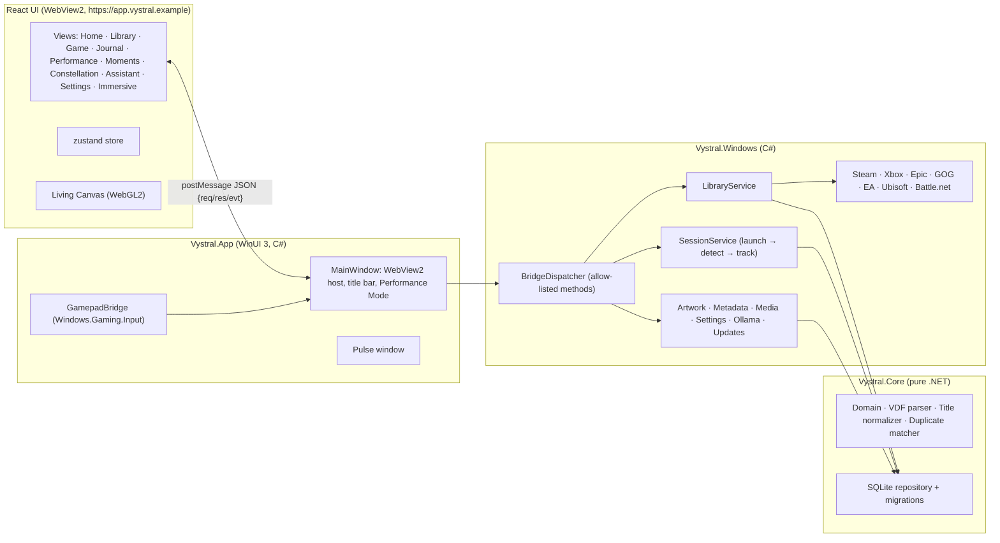

# VYSTRAL architecture

VYSTRAL is a **modular monolith**: one Windows process owns the window, the data and every integration; the interface is a React app hosted in WebView2 inside that process. There is no local web server and no background service.

## Projects

| Project | Target | Responsibility |
|---|---|---|
| `src/Vystral.Core` | `net10.0` | Domain model, Valve KeyValues (VDF) parser, title normalization, conservative duplicate matching, SQLite schema/migrations/repository, bridge DTOs. No Windows dependencies, so it is fully unit-testable. |
| `src/Vystral.Windows` | `net10.0-windows10.0.22621` | Store adapters, launch validation and execution, process detection, read-only performance sampling, artwork cache, metadata enrichment, Moments media, Ollama client, Velopack updater, settings, and the bridge dispatcher with every handler (`AppBackend*`). |
| `src/Vystral.App` | WinUI 3 (Windows App SDK 2.5, self-contained, unpackaged) | Entry point, single-instance handling, the window, WebView2 hosting and lockdown, native file pickers, controller input, Performance Mode, the Pulse window. |
| `ui/` | React 19 + TypeScript (strict) + Vite | The entire interface. Talks only to the bridge. |
| `tests/Vystral.Tests` | xunit v3 | Core, adapters (with fixture files and a fake registry), services and bridge. |

## Key decisions

**WinUI 3 + WebView2 rather than Electron or pure XAML.** WinUI gives a genuinely native window (Mica-capable title bar, AppWindow presenters for full-screen, Windows.Gaming.Input, packaged-app activation) and a single self-contained process tree. WebView2 gives the GPU-accelerated motion, shaders and typography the design calls for, and lets the UI be developed and tested in a normal browser. WebView2 is part of Windows 11, so there is no bundled browser.

**No local HTTP server.** UI files are served by `SetVirtualHostNameToFolderMapping` from the install folder (`https://app.vystral.example/`). Artwork is served from a second mapping that points only at the private art cache (`https://art.vystral.example/`). Media from user-approved folders goes through a filtered `WebResourceRequested` handler (`https://media.vystral.example/`) that resolves paths only inside approved folders and only for image/video types. Reserved `.example` hostnames never collide with real sites.

**One message bridge, strictly typed.** The UI sends `{kind:"req", id, method, params}` with `postMessage`; the host replies `{kind:"res", id, ok, result|error}` and pushes `{kind:"evt", name, payload}`. Only registered methods run. Parameters bind to C# records with unknown members rejected, and every handler validates IDs (`[0-9a-f]{32}`), string lengths and control characters. File paths **never** come from the UI: they come from native pickers or the database. Host objects and dev tools are disabled in release builds, and all navigation outside the app origin is cancelled.

**Adapters are read-only and honest.** Each `IPlatformAdapter` declares `AdapterCapabilities` and plain-language `Limitations`, which the Settings page shows verbatim. Adapters read documented local manifests and registry keys. They never read credentials and never write. Each runs isolated with a 30 s timeout; a failed scan changes nothing, so a broken integration can't erase history.

**Launch is validated, observed and never repeated.** `LaunchValidator` allow-lists URI schemes per platform (`steam:` only for Steam, and so on), validates AUMIDs, and only starts `.exe` files inside the game's own install folder. URIs go through ShellExecute, executables through CreateProcess with an argument list (no shell), and packaged games through `IApplicationActivationManager`. `SessionService` reports *running* only after it observes a process under the install folder (using `PROCESS_QUERY_LIMITED_INFORMATION` image paths, the same data Task Manager shows). It follows launcher→game hand-offs and never relaunches anything.

**Performance Mode.** When a session is running, the host minimizes the window, hides the WebView2 controller and calls `TrySuspendAsync()`, which suspends the renderer. Controller polling stops and AI and metadata work pause. Events that arrive meanwhile are buffered and replayed on resume. Measured CPU while minimized is 0 ms over 15 s (see [PERFORMANCE.md](PERFORMANCE.md)).

**Data.** SQLite in WAL mode at `%LOCALAPPDATA%\VYSTRAL.Data\vystral.db`, outside the install folder that Velopack replaces on update. Platform data (`installations`) is kept separate from canonical games (`games`) and from user data (notes, ratings, collections, sessions). Migrations are append-only, each runs in a transaction, and the file is backed up before any upgrade. A failed migration keeps the old file and starts fresh, so games remain launchable.

**Duplicates.** Evidence, strongest first: same installation identity, then a shared Steam appid, then an identical normalized title *including edition tokens* on different stores. Same-store same-title items are never merged. Base-title matches across editions or remasters become *suggestions* the user confirms. Manual merges and unmerges are pinned (`manual_link`).

**Metadata.** Optional lookups use Steam's public store pages, rate-limited to one request per 1.6 s, with the source recorded in `metadata_source`. Games without a Steam appid are matched only on an exact normalized title with a single candidate, so the wrong game's art never appears. Text is stripped of markup and rendered as plain text.

**AI is a separate, optional layer.** `OllamaService` talks to `127.0.0.1:11434` from C#, not from the page (which Ollama's CORS rules would block anyway). Structured answers are validated against a whitelist schema in `ValidateQuery`. The model can only *describe* or *propose*: any action still goes through the same user-driven bridge calls. Inference is refused while a game runs.

**Windows shell integration.** Notifications are toasts sent as VYSTRAL's AppUserModelID (`velopack.Vystral`, the same ID as the Start menu shortcut; `Vystral.Dev` for development builds) with `activationType="protocol"`. Selecting one opens `vystral://open?route=…`; Windows starts `Vystral.exe --uri <uri>`, single-instance redirection hands the activation to the running window, and the route is re-validated (`ActivationUri`) before the UI receives `app.navigate`. The scheme and AUMID live under `HKCU\Software\Classes` (written by the Velopack install/update hooks and repaired on every start; removed on uninstall). When Living Canvas is off, the window uses a Mica backdrop (`AppearanceHost`, `system.accent` / `window.backdrop`): WebView2's background becomes transparent and the page keeps everything opaque except the title bar and sidebar.

**Updates.** Velopack reads `releases.win.json` from the latest GitHub release, downloads the full or delta package with SHA verification, and applies it on restart, or silently after exit when the user doesn't restart. Updates never apply while a game is running.

## Failure isolation

| Failure | Effect |
|---|---|
| A store adapter throws or times out | That platform's games are kept as-is; a toast explains; others scan normally |
| Metadata or artwork network errors | Enrichment stops quietly for this run; local data unaffected |
| Ollama missing or crashed | AI features show a status card; nothing else changes |
| WebView2 renderer crash | Host reloads the UI; native session tracking continues |
| WebView2 runtime missing | Native error screen with a download link |
| DB migration failure | Old DB kept in `backups/`, fresh DB created, user told |
| Crash during a session | Open sessions are closed on next start using their last sample |
| Repeated crashes | Hold **Shift** on start (or `--safe-mode`) to disable effects, AI and downloads |

## Extension points

- **New store:** implement `IPlatformAdapter` in `Vystral.Windows/Integrations`, add fixture tests, and register it in `AdapterCatalog`. Add its URI scheme to `LaunchValidator` if it launches by protocol.
- **New bridge method:** add a typed params record and `Dispatcher.Register<T>(…)` in an `AppBackend.*.cs` partial, validate every input, and mirror the types in `ui/src/bridge/types.ts`.
- **Plugins:** intentionally not supported. Any future plugin system would need a permission manifest and process isolation.
